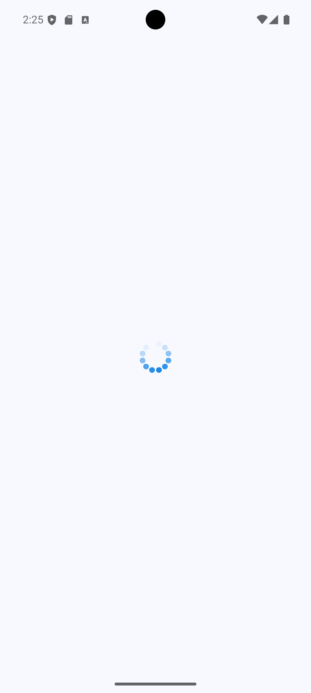
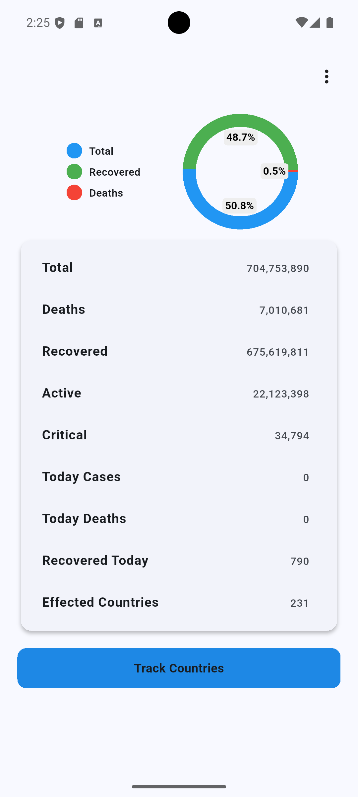
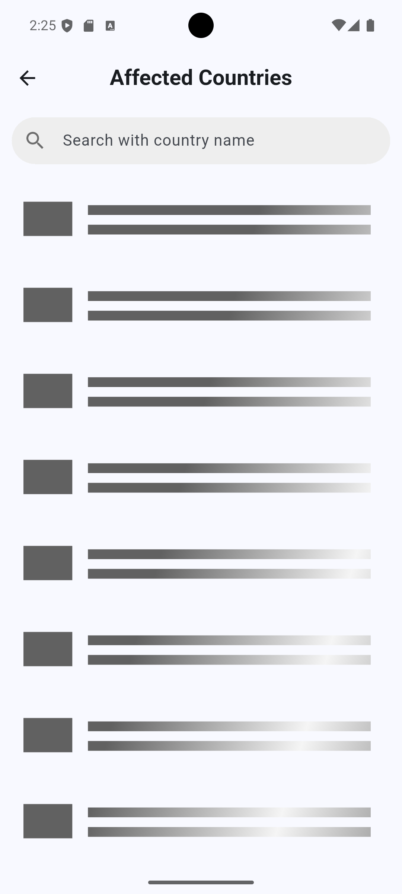
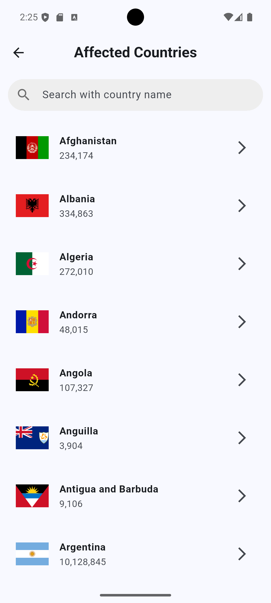
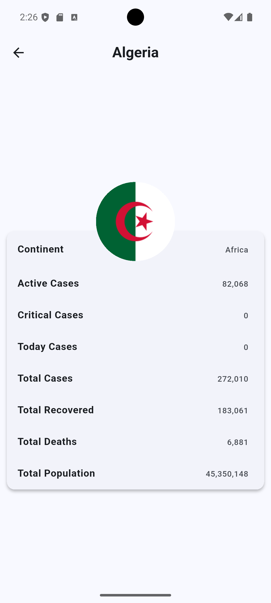
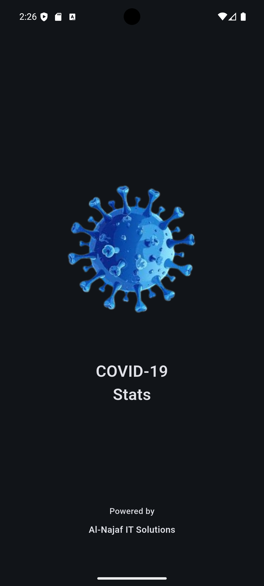
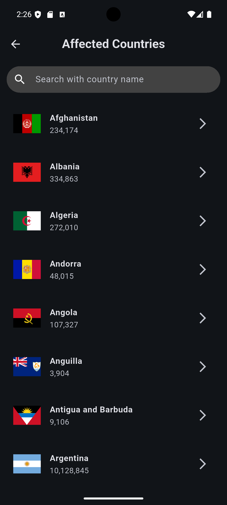
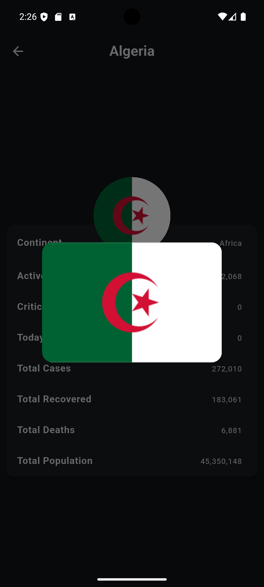
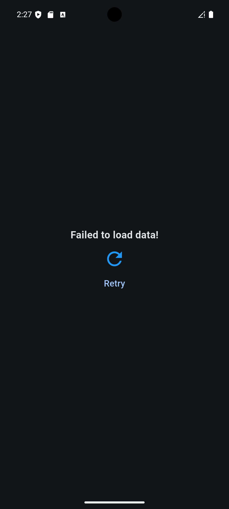

# 🦠 COVID-19 Stats App (Flutter)

A fully functional **COVID-19 Tracker mobile application** built using **Flutter**, focused on practicing **API integration**, **state management**, and **data visualization**.

This project is part of my learning journey where I implemented multiple real-world techniques commonly used in production Flutter apps.

---

## 📌 Project Overview

This app fetches **live COVID-19 statistics** from a public API and displays:

- Global COVID-19 data  
- Country-wise statistics  
- Visual representation using charts  

The main goal of this project was **hands-on learning**, not just displaying data but understanding **how data flows from API → service → UI**.

---

## 🚀 What I Have Implemented

### ✅ API Integration (Multiple Approaches)

I explored **two different API integration techniques**:

#### 1️⃣ API Integration With Model Classes

- Created **model classes** to map JSON responses  
- Used `fromJson()` constructors for clean data parsing  
- Improved **type safety**, readability, and maintainability  

#### 2️⃣ API Integration Without Model Classes

- Directly accessed API response using `List<dynamic>`  
- Useful for quick testing and understanding raw API structures  
- Helped me clearly understand why models are important in large apps  

Both approaches are intentionally used to **compare real-world practices**.

---

### ✅ Services Layer Architecture

- All API calls are handled inside service classes  
- Keeps UI clean and focused only on presentation  
- Follows **clean architecture principles**

---

### ✅ State Management

- Used Provider for state management
- Used **StatefulWidget** where necessary  
- Managed loading, error, and success states  
- Ensured UI updates properly after API responses  

---

### ✅ UI & UX Features

- Clean and minimal UI  
- Responsive layouts  
- Scrollable views with smooth performance  
- Proper separation of screens  
- Animations by using different packages

---

### ✅ Charts & Data Visualization

- Implemented charts to visualize COVID-19 data  
- Makes statistics easier to understand at a glance  

---

## 🖼️ App Screenshots

<table>
  <tr>
    <td></td>
    <td></td>
    <td></td>
    <td></td>
  </tr>
  <tr>
    <td></td>
    <td></td>
    <td></td>
    <td></td>
  </tr>
  <tr>
    <td></td>
    <td></td>
    <td></td>
    <td></td>
  </tr>
</table>

---

## 🧠 Learning Outcomes

Through this project, I learned:

- How real APIs work in Flutter  
- Difference between **model-based** and **non-model-based** API handling  
- Importance of clean architecture  
- Proper separation of UI and business logic  
- Working with charts and asynchronous data  

---

## 🛠️ Tech Stack

- Flutter  
- Dart  
- REST API  
- Charts & UI libraries  

---

## 📌 Purpose of This Project

This project was created **purely for learning and practice**, under the guidance of my tutor, to strengthen my Flutter development skills and prepare for more complex production-level applications.

---

## 👨‍💻 Author

**Muhammad Aftab Liaqat**  
Flutter Developer | Software Engineer 

---

⭐ If you find this project helpful or educational, feel free to star the repository!

## 📄 License

Copyright (c) 2026 Muhammad Aftab Liaqat

All rights reserved.

No part of this repository may be copied, modified, merged, published,
distributed, sublicensed, or sold without the prior written permission
of the author.

Unauthorized use of this code is strictly prohibited.

All rights are reserved by the author.  
The code is shared publicly for **learning and portfolio viewing only**.

